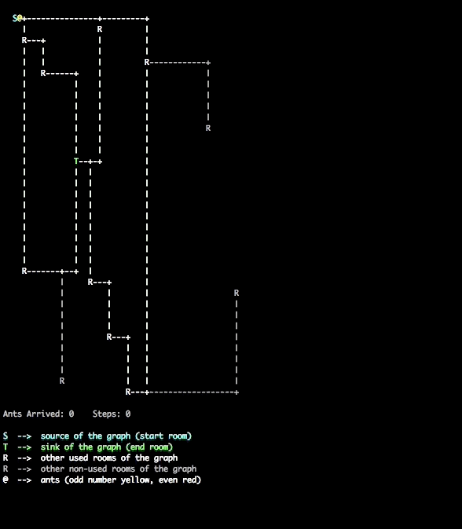

# lem-in
This program takes a graph (rooms with un-directed connections) and computes an efficient way to move N ants from source node to sink node. It also outputs an animated movement of the ants (flag -v).

## Usage
Run `make`. An executable will compile. Currently only tested on OS X.

Run with `./lem-in < Filename`.

A collection of sample ant farms is included in the `maps/` folder.

Visualizer example - run `./lem-in -v < maps/map2.c`



## Map generator

You can also use the included map generator `./generator --big | time ./lem-in`.

See `./generator --help` for details on the generator.

## Flags
| Command | Description |
| ------ | ------ |
| --help | Usage |
| -n | Print total number of moves |
| -p | Print paths |
| -q | Quiet mode |
| -v | Launch visualizer |

## Format
The map has a specific format:
```console
3         <- Number of Ants
##start   <- Indicates the starting point
##end     <- Indicates the end
S 0 0     <- Format Room `NAME X Y`
S-T       <- Link between two rooms (undirected graph)
^D        <- end
```

## Allowed functions:
`malloc`, `free`, `perror`, `strerror`, `read`, `write`, `exit`.
## Keywords
C language, problem solving, pathfinding, Dijkstra’s algorithm, efficiency, optimization.
